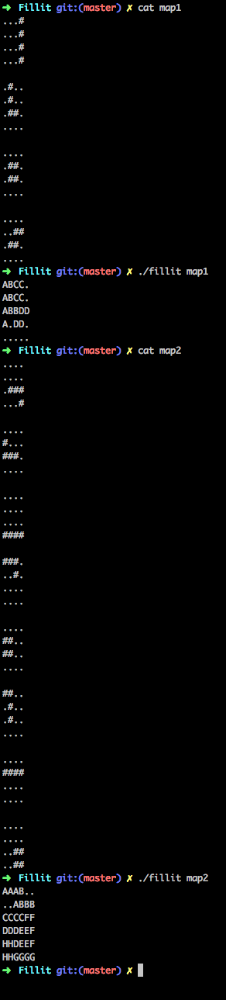

# Fillit
2e projet de la branche générale du [cursus 42](https://www.42.fr).

## Description

Ce projet consiste à remplir une grille d'un maximum de bloc de Tetris.
La taille de la grille et la forme/nombre de Tetris sont modulables.
Mon code s'appuie sur le backtracking et va chercher le meilleur agencement possible  entre toutes les pièces ainsi que de la taille de la grille.

## Usage

```
$> make
$> ./RT file/file.rt
```

## Exemple imagée

